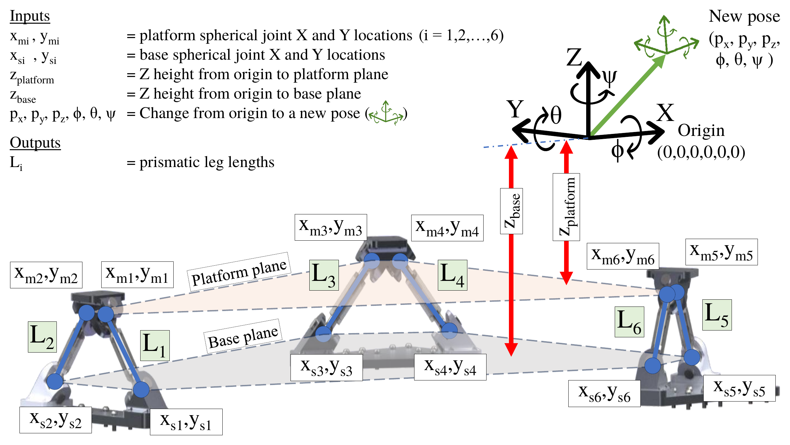
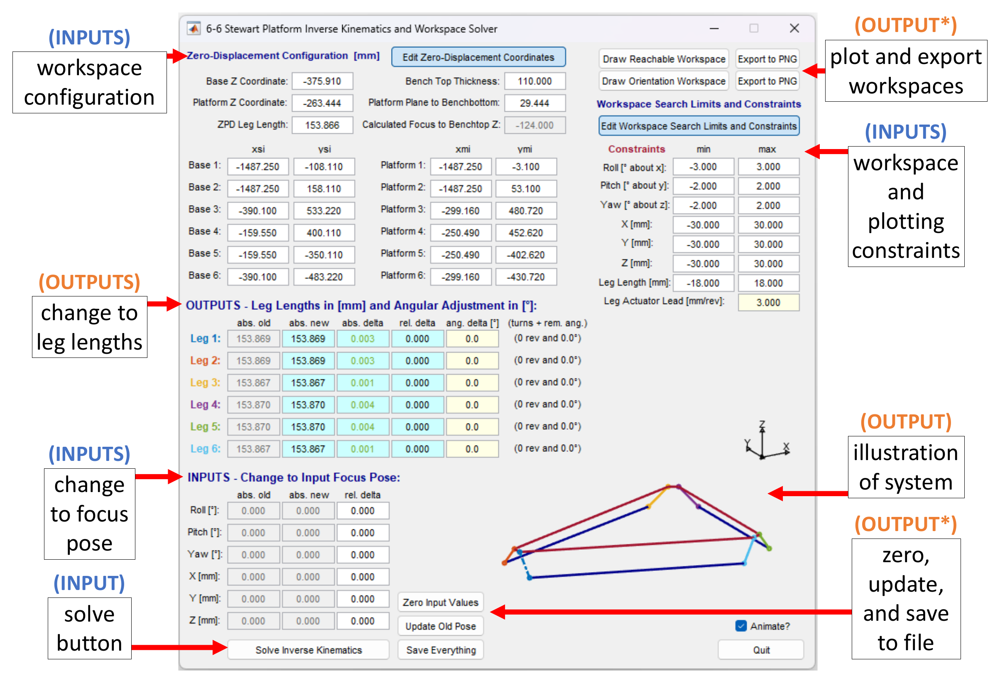
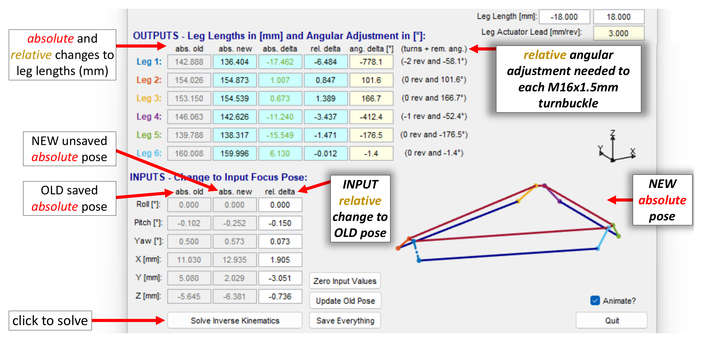
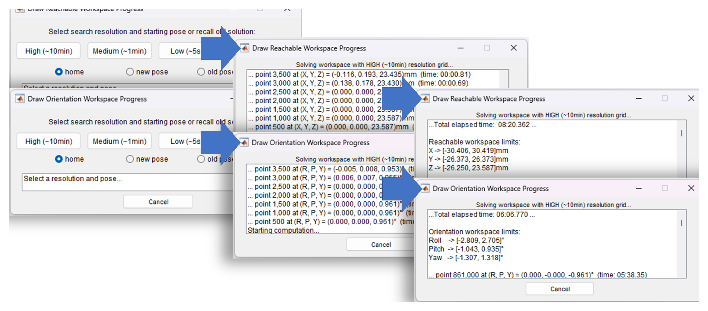
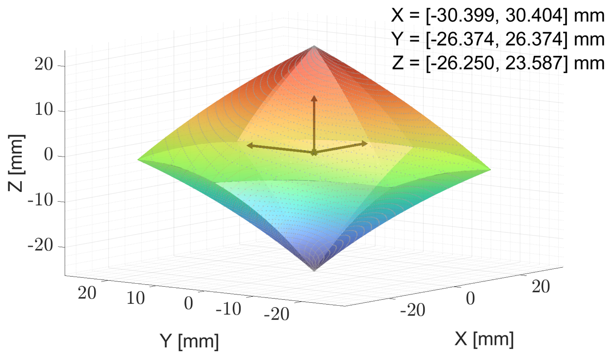
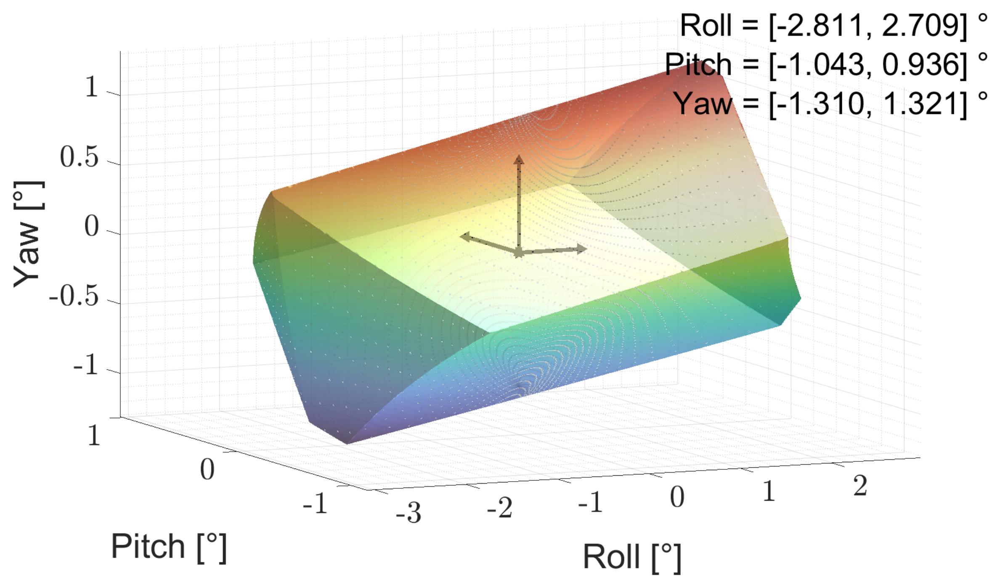
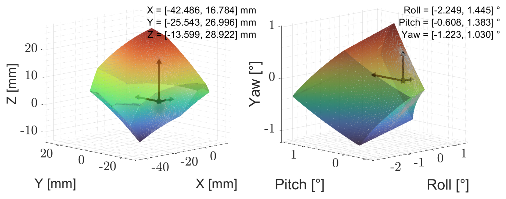
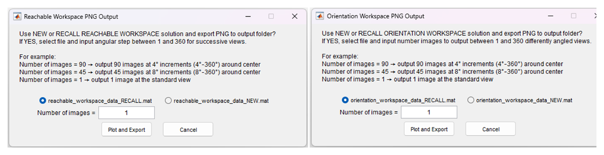

# Hexapod Inverse Kinematics & Workspace Calculator

A tool for computing and visualizing the **inverse kinematics (IK)** and **workspace** of a
**6-6 Gough-Stewart platform** — commonly known as a **hexapod**. The "6-6" means six independent
base joints and six independent platform joints; the solver assumes a **fully general geometry with
no symmetry requirement**, so any valid joint layout is supported. Given a commanded pose it solves
the actuator (leg) lengths needed to reach it, draws the hexapod, and maps the **reachable**
(translational) and **orientation** (rotational) workspaces — giving clear insight into the
system's operational limits for safe, precise alignment.

*(The mechanism is called a hexapod throughout the rest of this document.)*

- **Original concept/author:** Joe Brown (CSU Sacramento), 2006 — <https://github.com/jotux/Steward-Platform-Forward-Kinematics-Solver>
- **Adapted & extended by:** Adam B. Johnson (University of Victoria), 2022–2025

> The figures in this README come from the dissertation, where the calculator was adapted to align
> the SPIDERS instrument (Subaru Pathfinder Instrument for Detecting Exoplanets & Retrieving Spectra)
> on the Subaru Telescope. See [References](#references).

---

## Choose your version

The calculator comes in three interchangeable forms. **All three implement the same math and share
the same input/output file formats** (`formdata.txt` settings and `.mat` workspace data), so results
and saved files are compatible across them.

| Version | Best for | Where it lives / how to get it |
|---|---|---|
| **Windows executable** (`.exe`) | Running on Windows with **no install** — no MATLAB, no Python, nothing to set up. Just download and double-click. | **[Releases](../../releases)** (download the latest `HexapodCalculator.exe`) |
| **MATLAB** | MATLAB users; the original, reference implementation. | [`matlab/`](matlab/) — run `RUN_HEXAPOD_CALCULATOR` |
| **Python** | Building your own binary (incl. **macOS / Linux**), or reading/modifying the source. | [`python/`](python/) — `pip install -r requirements.txt` then `python run.py` |

**Which should I use?**
- Just want to *use* the tool on Windows → grab the **executable** from Releases.
- Have MATLAB and want the original → **MATLAB** version.
- Want it on **macOS or Linux**, or want to build/modify it yourself → **Python** version (it also
  builds the Windows `.exe`).

The Windows executable is built from the Python version. The Python port additionally offers a
docked output console, light/dark/system colour themes, a startup splash, per-window app icons, and
fully non-blocking workspace/PNG rendering. Prebuilt macOS/Linux binaries are **not** provided —
the Python version builds them, but those builds are currently **untested** (contributions welcome).

---

## Hexapod geometry & inverse kinematics



*Figure 2.14 — Hexapod (6-6 Gough-Stewart platform) layout: the base and platform coordinate frames,
spherical joint positions, and an example displaced pose used as the IK target.*

The platform is defined by six base joints **aᵢ** and six platform joints **bᵢ**, each given by its
planar (X, Y) location and a vertical plane height. The **home pose** places the platform's input
focus at the global origin, with equal leg lengths and parallel base and platform planes.

A commanded pose is a translation **p** = [pₓ, p_y, p_z] plus a **ZYX Euler rotation** — yaw (ψ)
about Z, then pitch (θ) about Y, then roll (ϕ) about X. The IK transforms each platform joint into
the global frame with the homogeneous transform **T** (rotation **R** and translation **p**), then
computes each leg length as the Euclidean distance between the transformed platform joint **b′ᵢ**
and its base joint **aᵢ**:

```
Lᵢ = ‖aᵢ − b′ᵢ‖ = ‖aᵢ − T·bᵢ‖        (i = 1 … 6)
```

The resulting set {L₁ … L₆} is the IK solution for that pose. Saved leg lengths then serve as the
reference for computing the **relative** adjustments needed to move to a new pose.

---

## The calculator interface



*Figure 2.16 — The calculator at the home configuration, with the input and output sections
labelled.*

The interface is organized into **Inputs** and **Outputs**:

**Inputs**

- **Zero-Displacement Configuration [mm]** — base/platform joint coordinates and reference-plane
  heights that define the home pose. The calculated focus-to-benchtop height is shown for
  verification, and inputs can be locked to prevent accidental edits.
- **Workspace Search Limits and Constraints** — allowable ranges for the pose inputs and the
  resulting leg lengths. These also bound the workspace search; out-of-range `abs. delta` outputs
  are flagged **red** and valid values **green**.
- **Change to Input Focus Pose** — the commanded offset in X, Y, Z, roll, pitch, and yaw relative to
  the last saved pose. Both the previous and updated absolute poses are shown after solving.

**Outputs**

- **Leg Lengths [mm] and Angular Adjustment [°]** — absolute and relative leg-length changes, plus
  the equivalent turnbuckle revolutions and residual angle derived from the actuator lead.
- **System Illustration** — the hexapod drawn at the current geometry and pose, with colour-coded
  legs and the global origin marked.
- **Saving to File** — stores the active pose, configuration, and constraints to a `.txt` file for
  automatic reloading and external access.
- **Draw Reachable / Orientation Workspace** and **Export to PNG** — solve and plot the workspaces
  (saved as `.mat`) and export multi-angle PNG views.

---

## Inverse kinematics output



*Figure 2.17 — IK output: absolute leg-length changes and the corresponding angular
(turnbuckle) adjustments.*

After solving, the output table reports the absolute and relative change in each leg length. The
**abs. delta** column is colour-coded against the configured limits (**green** = valid,
**red** = out of range). Angular outputs convert each leg's change into actuator revolutions and a
residual angle (in degrees) using the specified lead — directly giving the turnbuckle adjustment
needed for manual alignment of larger pose changes.

---

## Workspace analysis

Using the same IK framework, the calculator maps two complementary workspaces:

- the **reachable workspace** — attainable X, Y, Z translations at a fixed orientation, and
- the **orientation workspace** — attainable roll, pitch, and yaw at a fixed position.

In both cases the boundary is found with a **radial-bisection search over a spherical grid**: from
the chosen pose, the search refines the boundary along each radial direction until it reaches the
actuator stroke (leg-length) limits. A preliminary check confirms the search is feasible within the
defined constraints. The evaluation can start from the **home**, **new**, or **old** pose.



*Figure 2.18 — Resolution and starting-pose selection, with live status feedback. Coarser
resolutions solve faster but give lower-fidelity boundaries.*



*Figure 2.19 — Reachable workspace from the home pose (roll/pitch/yaw = 0). Faint dots mark sampled
boundary points; the closed surface uses all of them, coloured by Z for clarity.*

For a symmetric hexapod, the home configuration produces a characteristic hexagonal pattern in the
XY plane, and over the full Z range the reachable workspace forms a **hexagonal bipyramid**.



*Figure 2.20 — Orientation workspace from the home pose (X, Y, Z fixed).*

The orientation workspace, shaped by actuator limits and translation coupling, forms an
asymmetric, **dome-like** volume centred on the home orientation.



*Figure 2.21 — Adjusted reachable (left) and orientation (right) workspaces from a representative
pose. The pose sits near one leg's range limit, shown by its proximity to the workspace edges.*

After a pose change, both workspaces can be re-evaluated to assess its effect on reachability.



*Figure 2.22 — PNG export: save workspace plots from current or saved `.mat` data, optionally as a
series of evenly spaced viewing angles for assembling videos or GIFs.*

---

## Quick start by version

### Windows executable (no install)
1. Download `HexapodCalculator.exe` from the **[Releases](../../releases)** page.
2. Double-click it. On first launch it creates a `formdata.txt` next to itself with default values;
   replace it with your own saved configuration any time.
3. Windows SmartScreen may warn about an unrecognized app (the exe isn't code-signed) — choose
   **More info → Run anyway**.

### MATLAB
See [`matlab/README.md`](matlab/README.md). In short: open MATLAB (R2020b+), `cd` into `matlab/`,
add the folder to the path, and run `RUN_HEXAPOD_CALCULATOR`.

### Python (and building your own binary)
See [`python/README.md`](python/README.md). In short:
```bash
cd python
python -m venv .venv           # Python 3.11 or 3.12 recommended
# Windows:  .venv\Scripts\activate     macOS/Linux:  source .venv/bin/activate
pip install -r requirements.txt
python run.py                  # run from source
```
To build a standalone binary: `build_windows.bat` (Windows), `./build_macos.sh` (macOS),
or `./build_linux.sh` (Linux).

---

## Repository layout

```
.
├── matlab/          Original MATLAB program (RUN_HEXAPOD_CALCULATOR.m + solvers/GUI/MEX)
├── python/          Cross-platform Python/Qt port (source, build scripts, PyInstaller spec)
├── docs/figures/    Figures used in this README (from the dissertation)
└── README.md        This file
```
The Windows `.exe` is distributed via **Releases** rather than committed to the repository (binaries
and build artifacts don't belong in git — see `.gitignore`).

---

## Usage tips (all versions)

- **Save Everything** writes the full window configuration to `formdata.txt` (auto-loaded on start).
- Enter a **Change to Input Focus Pose** and solve to get leg lengths and turnbuckle adjustments.
- **Home** or **Zero** the input focus for quick trials of different poses.
- Choose a workspace **resolution** before running (speed vs. fidelity); `.mat` exports are automatic
  after drawing a figure.
- Use **NEW** or **RECALLed** `.mat` data to export PNGs — including a series of evenly spaced angles
  to assemble videos or GIFs offline.

---

## References

1. J. Brown, *Stewart Platform Forward Kinematics Solver*, CSU Sacramento, 2006.
   <https://github.com/jotux/Steward-Platform-Forward-Kinematics-Solver>
2. A. B. Johnson, *Beyond the speckles: New horizons in high-contrast imaging for exoplanet
   science*, Ph.D. dissertation, University of Victoria, Victoria, BC, Canada, 2025. [Online].
   Available: <https://hdl.handle.net/1828/22655>
   (Source of the adapted calculator and Figures 2.14, 2.16–2.22.)
