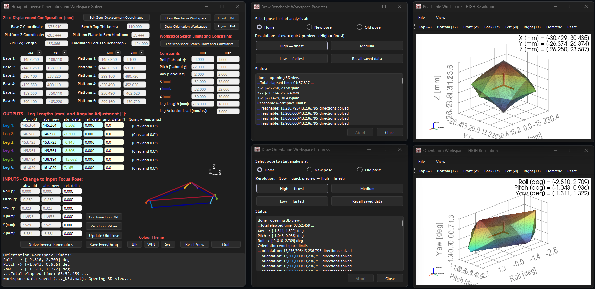
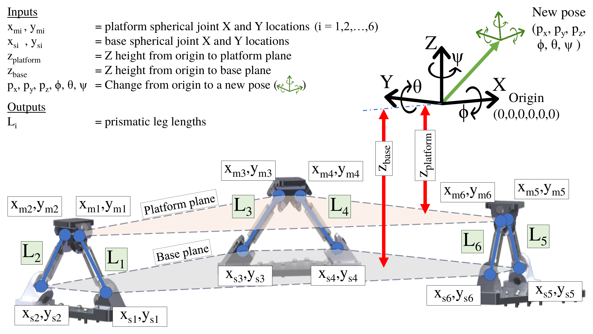
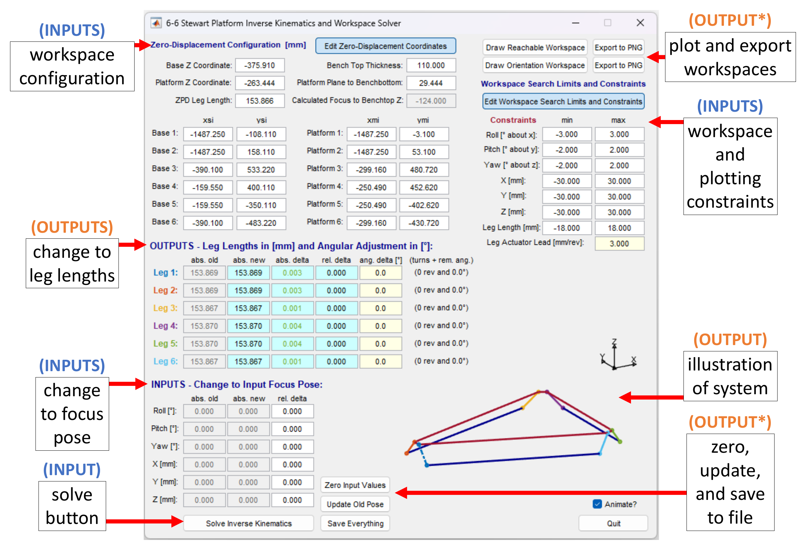
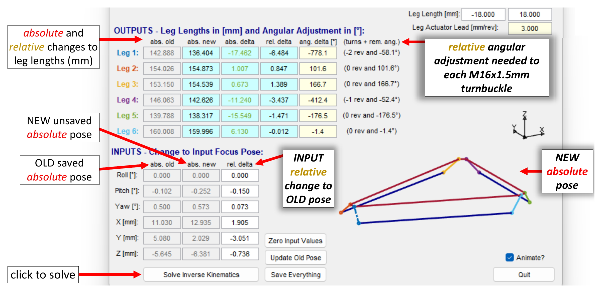
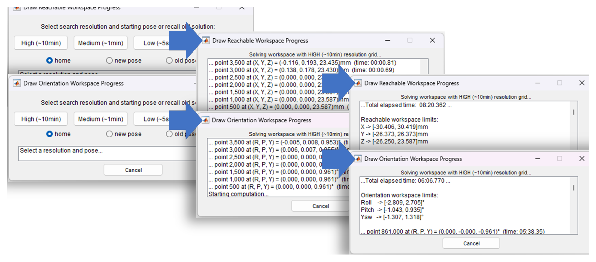
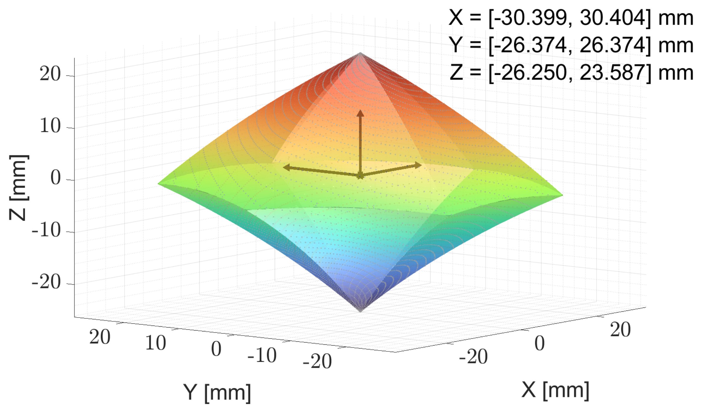
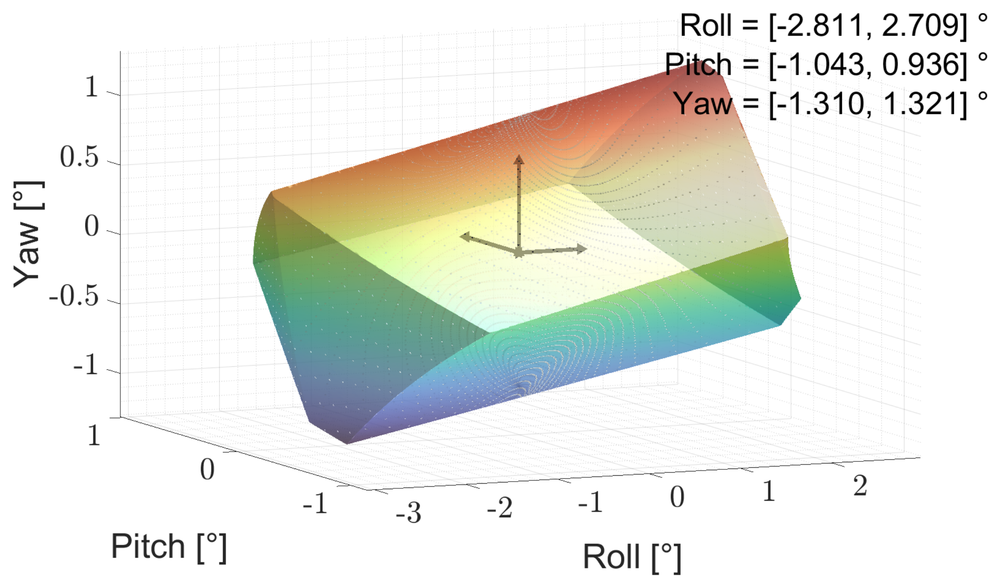
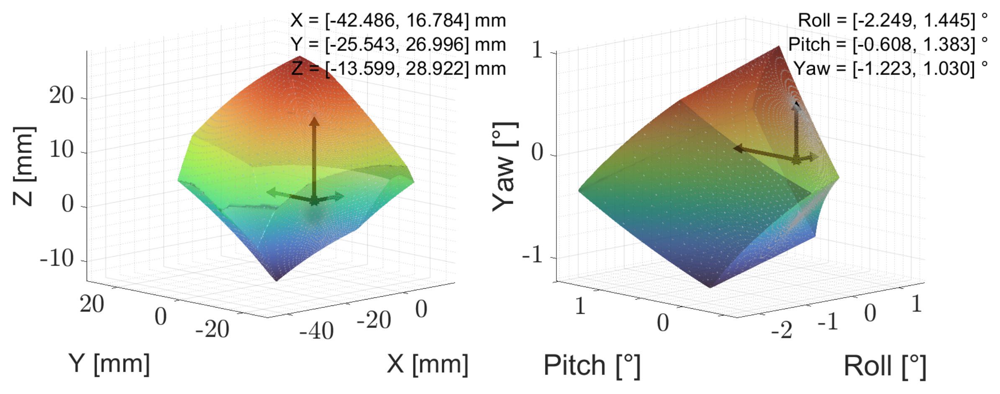
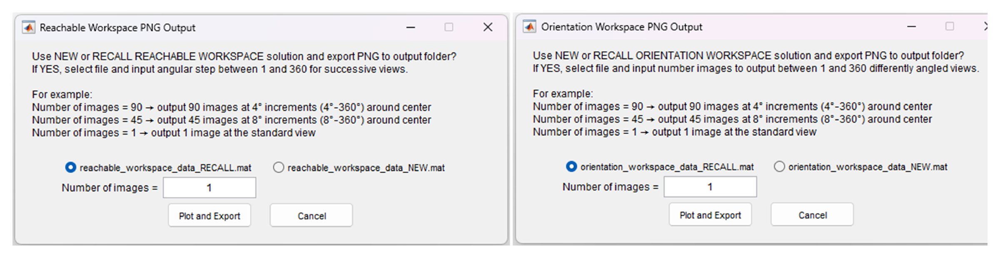

# Hexapod — Inverse Kinematics & Workspace Calculator

A tool for computing and visualizing the **inverse kinematics (IK)** and **workspace** of a
**6-6 Gough-Stewart platform** — commonly known as a **hexapod**. The "6-6" means six independent
base joints and six independent platform joints; the solver assumes a **fully general geometry with
no symmetry requirement**, so any valid joint layout is supported. Given a commanded pose it solves
the actuator (leg) lengths needed to reach it, draws the hexapod, and maps the **reachable**
(translational) and **orientation** (rotational) workspaces — giving clear insight into the
system's operational limits for safe, precise alignment.

*(The mechanism is called a hexapod throughout the rest of this document.)*

- **Original concept/author:** Joe Brown (CSU Sacramento), 2006 — <https://github.com/jotux/Steward-Platform-Forward-Kinematics-Solver>
- **Adapted & extended by:** Adam B. Johnson, 2022–2026 (University of Victoria, 2022–2025)

> Some figures are from the author's dissertation, where the calculator was first developed. See [References](#references).



---

## Choose your version

The calculator comes in three interchangeable forms. **All three implement the same math and share
the same input/output file formats** (`formdata.txt` settings and `.mat` workspace data), so results
and saved files are compatible across them.

| Version | Best for | Where it lives / how to get it |
|---|---|---|
| **Prebuilt application** | Running with **no install** on Windows or Linux — no MATLAB, no Python, nothing to set up. | **[Releases](../../releases)** (`HexapodCalculator.exe`, `HexapodCalculator-linux.tar.gz`) |
| **MATLAB** | MATLAB users; the original, reference implementation. | [`matlab/`](matlab/) — run `RUN_HEXAPOD_CALCULATOR` |
| **Python** | Building your own binary (incl. **macOS / Linux**), or reading/modifying the source. | [`python/`](python/) — `pip install -r requirements.txt` then `python run.py` |

**Which should I use?**
- Just want to *use* the tool on Windows or Linux → grab the **prebuilt application** from Releases.
- Have MATLAB and want the original → **MATLAB** version.
- Want it on **macOS**, or want to build/modify it yourself → **Python** version (it also builds the
  Windows and Linux applications).

The prebuilt applications are built from the Python version. The Python port additionally offers a
docked output console, light/dark/system colour themes, a startup splash, per-window app icons, and
fully non-blocking workspace/PNG rendering. A macOS `.app` can also be built from it, though that
build is currently **untested** (contributions welcome).

---

## Hexapod geometry & inverse kinematics



*Hexapod (6-6 Gough-Stewart platform) layout: the base and platform coordinate frames, spherical
joint positions, and an example displaced pose used as the IK target. The figure shows planar joint
sets for clarity; the calculator takes an independent X, Y, Z for every joint, so neither set need
be planar.*

The platform is defined by six base joints **aᵢ** and six platform joints **bᵢ**, each given by its
own (X, Y, Z) location: neither set of joints is assumed to lie in a plane. The **home pose** places
the platform's input focus at the global origin.

A commanded pose is a translation **p** = [p<sub>x</sub>, p<sub>y</sub>, p<sub>z</sub>] plus a **ZYX Euler rotation** — yaw (ψ)
about Z, then pitch (θ) about Y, then roll (ϕ) about X. The IK transforms each platform joint into
the global frame with the homogeneous transform **T** (rotation **R** and translation **p**), then
computes each leg length as the Euclidean distance between the transformed platform joint **b′ᵢ**
and its base joint **aᵢ**:

<h3 align="center"><code>Lᵢ = ‖aᵢ − b′ᵢ‖ = ‖aᵢ − T·bᵢ‖</code>&emsp;&emsp;&emsp;&emsp;&emsp;&emsp;<code>(i = 1 … 6)</code></h3>

The resulting set {L₁ … L₆} is the IK solution for that pose. Saved leg lengths then serve as the
reference for computing the **relative** adjustments needed to move to a new pose.

---

## The calculator interface



*The calculator at the home configuration, with the input and output sections labelled.*

The interface is organized into **Inputs** and **Outputs**:

**Inputs**

- **Zero-Displacement Configuration [mm]** — the X, Y, Z of every base and platform joint and the
  ZPD leg length that define the home pose. Inputs are locked unless **Edit Zero-Displacement
  Coordinates** is on; the ± buttons over each column add one value to all six joints of that column.
- **Workspace Search Limits and Constraints** — allowable ranges for the pose inputs and the
  resulting leg lengths. These also bound the workspace search; out-of-range `abs. delta` outputs
  are flagged **red** and valid values **green**.
- **Change to New Pose** — the commanded offset in X, Y, Z, roll, pitch, and yaw relative to
  the last saved pose. Both the previous and updated absolute poses are shown after solving.
- **Current Origin** and **Change Coords.** — the frame everything is expressed in: the point of
  interest the pose, illustration and workspaces are referenced to, and the labelling of the X, Y, Z
  axes and of the rotation angles. See
  [Origins, points of interest and coordinate frames](#origins-points-of-interest-and-coordinate-frames).

**Outputs**

- **Leg Lengths [mm] and Angular Adjustment [°]** — absolute and relative leg-length changes, plus
  the equivalent turnbuckle revolutions and residual angle derived from the actuator lead.
- **System Illustration** — the hexapod drawn at the current geometry and pose, with colour-coded
  legs and the global origin marked.
- **Saving to File** — stores the active pose, configuration, and constraints to a `.txt` file for
  automatic reloading and external access.
- **Draw Reachable / Orientation Workspace** and **Export to PNG** — solve and plot the workspaces
  (saved as `.mat`) and export multi-angle PNG views.
- **Incremental Adj. Table** — per-leg turn ratios for small manual moves along or about any axis of
  any origin, with PNG, Excel and text export. See
  [Incremental adjustment table](#incremental-adjustment-table).

---

## Inverse kinematics output



*IK output: absolute leg-length changes and the corresponding angular
(turnbuckle) adjustments.*

After solving, the output table reports the absolute and relative change in each leg length. The
**abs. delta** column is colour-coded against the configured limits (**green** = valid,
**red** = out of range). Angular outputs convert each leg's change into actuator revolutions and a
residual angle (in degrees) using the specified lead — directly giving the turnbuckle adjustment
needed for manual alignment of larger pose changes.

---

## Origins, points of interest and coordinate frames


*Left: the origins list, where each point of interest is a full frame relative to Origin 1. Right:
the axis-relabelling window, with the two triads showing the current and the new axes.*

Optical alignment is rarely done about a single point: X, Y and focus may be judged at an image
plane, then X, Y and roll at a pupil plane elsewhere on the bench. A rotation is only "pure" about
the point it is defined at, so each of those points needs its own frame.

**Current Origin** opens the origins list. **Origin 1** is the reference: the frame the joints were
entered in. Every other row is a point of interest defined by its X, Y, Z offset [mm] and its roll,
pitch, yaw orientation [°] relative to Origin 1. Rows can be added, renamed (up to 22 characters),
edited or deleted, and one row is selected as the active frame; Origin 1 is fixed at zero and cannot
be deleted.

Selecting an origin re-expresses everything rather than moving anything. With **A** the current frame
and **B** the selected one, each origin contributing its rotation **R** and offset **d** relative to
Origin 1, every joint coordinate becomes

<h3 align="center"><code>q′ = M·q + e</code>&emsp;&emsp;&emsp;&emsp;&emsp;&emsp;<code>M = R_Bᵀ·R_A</code>&emsp;&emsp;&emsp;&emsp;&emsp;&emsp;<code>e = R_Bᵀ·(d_A − d_B)</code></h3>

and the old and new poses follow as **R′ = M·R·Mᵀ**, **t′ = M·t + e − R′·e**, which leaves every leg
vector, and therefore every leg length, unchanged. A rotation entered afterwards is a rotation about
the selected point, about its axes. Pose deltas become new − old in the new frame, and every later
solve, ± adjustment, save and workspace analysis is referenced to it; the workspace windows and their
`.mat` files carry the origin's name. The sketch keeps the joints where they are on screen and the
view you have chosen, and only its triad follows the frame.

**Change Coords.** relabels the axes themselves. Each current axis is assigned a signed new axis
(+X, −X, … −Z); the choice is kept right-handed as you make it, the third row always being the cross
product of the two above it. Confirm builds the signed permutation **M** (det **M** = +1) and
expresses everything in the new axes: joints (**q′ = M·q**), both poses (**t′ = M·t**,
**R′ = M·R·Mᵀ**), the pose deltas, the search limits (each interval follows its axis and is mirrored
on a sign flip), the origin offsets and orientations, and the running ± totals. Leg lengths are
physically unchanged and the field labels stay X, Y, Z; only the numbers move.

A second section of the same window sets which axis roll, pitch and yaw rotate about. The roll axis
is free and pitch and yaw follow the right-hand rule as the next axes in cyclic order, giving the
three assignments XYZ (default), YZX and ZXY. Confirm re-extracts both poses and every origin's
orientation for the new assignment, so nothing moves physically, moves each angle's search interval
to the angle now about that axis, and relabels the constraint rows. The assignment is saved with the
configuration and travels with every workspace dataset, so the 3D windows keep the sketch's "up".

Both windows are modal, and Cancel or Close leaves everything as it was. Values are re-expressed at
the tool's three-decimal display precision (angles at 0.001°), so a leg length can differ by up to
about 0.01 mm after a frame change involving a rotation.

---

## Incremental adjustment table


*The table window and the PNG it exports: the ticked axes of each origin, the per-leg turn ratios,
and the sketch of each origin's frame carried into the export.*

Alignment on the bench is done by hand, one turnbuckle at a time, and the question is always the
same: to move the platform a little along or about one axis, how far must each leg turn relative to
the others? **Incremental Adj. Table** answers it for every axis of every origin at once.

Tick any of X, Y, Z, Roll, Pitch, Yaw for each origin. Each ticked axis becomes a row giving, for a
small move in the **+** direction of that axis of that origin's frame, the actuator turn of every
leg relative to the leg that turns the most. For the row's axis the platform is perturbed both ways
about the origin's point (a translation along the axis, or a Rodrigues rotation about it), the leg
lengths are differenced centrally, converted to actuator degrees through the lead, and normalized:

<h3 align="center"><code>ΔL = ½·[L(+δ) − L(−δ)]</code>&emsp;&emsp;&emsp;<code>Δθ = ΔL·360 / lead</code>&emsp;&emsp;&emsp;<code>ratio = Δθ / max|Δθ|</code></h3>

The lead cancels in the ratio, so the entries are independent of the thread pitch; the sign gives the
direction of turn, positive extending the leg. Each row carries a **Turn [°]** box: type the turn you
intend to give the reference leg and every entry becomes the degrees that leg must be turned, live as
you type, with **×** returning the row to 1.0. The decimal places are selectable, **Round up above
0.99** reads a ratio just short of one as exactly one, and the reference legs are set in bold, fixed
at the unit state so they stay visible whatever turns are entered.

**Export .PNG…**, **.TXT…** and **.XLSX…** write the table as shown: a print-ready image, a
box-ruled text table, or a workbook whose leg cells are live formulas (unit ratio × Turn) so the
turns can be tried out in Excel. The PNG and the workbook also carry a sketch of each origin's frame
(up to two) and the leg colour legend. The ticked axes, turns and decimal places are kept by
**Confirm** and saved with the configuration.

---

## Workspace analysis

Using the same IK framework, the calculator maps two complementary workspaces:

- the **reachable workspace** — attainable X, Y, Z translations at a fixed orientation, and
- the **orientation workspace** — attainable roll, pitch, and yaw at a fixed position.

The 3D workspace windows keep the sketch's "up": each dataset stores the sketch's display frame (for
the orientation workspace, times the angle-axes permutation), the window is viewed through it, and the
toolbar's Top / Front / Left / Isometric buttons act in that frame with their axis labels rewritten to
the data axis they look along. So after a Change Coords. that made Y the vertical axis, the workspace
surface still stands the way the sketch does.

In both cases the boundary is found with a **radial-bisection search over a spherical grid**: from
the chosen pose, the search refines the boundary along each radial direction until it reaches the
actuator stroke (leg-length) limits. A preliminary check confirms the search is feasible within the
defined constraints. The evaluation can start from the **home**, **new**, or **old** pose.



*Resolution and starting-pose selection, with live status feedback. Coarser
resolutions solve faster but give lower-fidelity boundaries.*



*Reachable workspace from the home pose (roll/pitch/yaw = 0). Faint dots mark sampled
boundary points; the closed surface uses all of them, coloured by Z for clarity.*

For a symmetric hexapod, the home configuration produces a characteristic hexagonal pattern in the
XY plane, and over the full Z range the reachable workspace forms a **hexagonal bipyramid**.



*Orientation workspace from the home pose (X, Y, Z fixed).*

The orientation workspace, shaped by actuator limits and translation coupling, forms an
asymmetric, **dome-like** volume centred on the home orientation.



*Adjusted reachable (left) and orientation (right) workspaces from a representative
pose. The pose sits near one leg's range limit, shown by its proximity to the workspace edges.*

After a pose change, both workspaces can be re-evaluated to assess its effect on reachability.



*PNG export: save workspace plots from current or saved `.mat` data, optionally as a
series of evenly spaced viewing angles for assembling videos or GIFs.*

---

## Quick start by version

### Prebuilt application (no install)

**Windows.** Download `HexapodCalculator.exe` from the **[Releases](../../releases)** page and
double-click it. SmartScreen may warn about an unrecognized app (the exe isn't code-signed) — choose
**More info → Run anyway**.

**Linux.** Download `HexapodCalculator-linux.tar.gz`, right-click → **Extract Here**, then
double-click `HexapodCalculator`. It arrives ready to run. Requires Ubuntu 24.04 or newer, or an
equivalent.

On first launch either one creates a `formdata.txt` next to itself with default values; replace it
with your own saved configuration any time.

### MATLAB
See [`matlab/README.md`](matlab/README.md). In short: open MATLAB (R2020b+), `cd` into `matlab/`,
add the folder to the path, and run `RUN_HEXAPOD_CALCULATOR`.

### Python (and building your own binary)
See [`python/README.md`](python/README.md). In short:
```bash
cd python
python -m venv .venv           # Python 3.11 or 3.12 recommended
# Windows:  .venv\Scripts\activate     macOS/Linux:  source .venv/bin/activate
pip install -r requirements.txt
python run.py                  # run from source
```
To build a standalone application: `build_windows.bat` (Windows), `./build_linux.sh` (Linux),
or `./build_macos.sh` (macOS).

---

## Repository layout

```
.
├── matlab/          Original MATLAB program (RUN_HEXAPOD_CALCULATOR.m + solvers/GUI/MEX)
├── python/          Cross-platform Python/Qt port (source, build scripts, PyInstaller spec)
├── docs/figures/    Figures used in this README
└── README.md        This file
```
The Windows and Linux applications are distributed via **Releases** rather than committed to the
repository (binaries and build artifacts don't belong in git — see `.gitignore`).

---

## Usage tips (all versions)

- Every value box accepts the standard copy / cut / paste shortcuts. Anything pasted or typed
  with more than three decimals is rounded to three at once (1.0011109 becomes 1.001); text that
  is not a number is refused. In the MATLAB version the rounding happens when the box is committed
  (Enter or leaving the box), and a non-number is reset to 0.000 with a console message.
- `formdata.txt` may be hand-edited with any number of decimals; on start-up every value is read,
  rounded to three decimals, and the file is rewritten in the canonical layout.
- **Save Everything** writes the full window configuration to `formdata.txt` (auto-loaded on start).
  A `formdata.txt` from an earlier version (single Base Z / Platform Z plane height and bench values,
  or an `origin_count` line) is read, converted forward and rewritten automatically at start-up.
- Enter a **Change to New Pose** and solve to get leg lengths and turnbuckle adjustments.
- **Quit**, **Escape** and the window's close button behave alike: they close at once when nothing
  has changed since the last **Save Everything**, and otherwise ask whether to save first.
- **Home** or **Zero** the input focus for quick trials of different poses.
- Use **Current Origin** to switch the pose, illustration and workspaces to a point of interest (e.g. a
  pupil plane) and back; press **Solve** first if you want a typed delta applied before switching.
- Every file dialog opens in the folder last used during the session, starting from the program's own
  folder.
- Choose a workspace **resolution** before running (speed vs. fidelity); `.mat` exports are automatic
  after drawing a figure.
- Use **NEW** or **RECALLed** `.mat` data to export PNGs — including a series of evenly spaced angles
  to assemble videos or GIFs offline.

---

## Release notes

**1.1** — feature release; configuration files from 1.0 are read and converted automatically.

- Every base and platform joint has an independent X, Y, Z; the plane-height and bench-related rows
  are gone, and the 3D sketch fits itself to its region for any geometry, frame or axis labelling.
- Origins are full frames (offset and orientation relative to Origin 1), and **Change Coords.**
  relabels the coordinate axes and assigns roll, pitch and yaw to axes, with every joint, pose,
  limit and origin re-expressed accordingly.
- New **Incremental Adj. Table**: per-leg turn ratios for small manual moves, with turn multipliers
  and PNG / Excel / text export.
- The 3D workspace windows keep the sketch's orientation and colour along that window's vertical.
- Quit, Escape and the window close button ask only when something has changed since the last save.
- Value boxes take the standard clipboard shortcuts and round to three decimals as you type;
  `formdata.txt` is read with any number of decimals and rewritten in the canonical layout.

**1.0** — initial release: inverse kinematics, workspace analyses and PNG export.


## License

MIT, see [`LICENSE`](LICENSE). The original MATLAB tool is by Joe Brown (see References);
this repository is an adaptation and extension of it.

## Code signing policy

Free code signing provided by [SignPath.io](https://signpath.io), certificate by
[SignPath Foundation](https://signpath.org).

The Windows executable on the Releases page is built by GitHub Actions from the tagged source in
this repository (`.github/workflows/build.yml`) and submitted to SignPath for signing from that
build. Nothing built on a developer machine is signed.

Team roles:
- Authors (commit access): Adam B. Johnson
- Reviewers (pull requests from anyone else): Adam B. Johnson
- Approvers (release signing requests): Adam B. Johnson

Privacy policy: this program will not transfer any information to other networked systems unless
specifically requested by the user or the person installing or operating it.


## References

1. J. Brown, *Stewart Platform Forward Kinematics Solver*, CSU Sacramento, 2006.
   <https://github.com/jotux/Steward-Platform-Forward-Kinematics-Solver>
2. A. B. Johnson, *Beyond the speckles: New horizons in high-contrast imaging for exoplanet
   science*, Ph.D. dissertation, University of Victoria, Victoria, BC, Canada, 2025. [Online].
   Available: <https://hdl.handle.net/1828/22655>
   (Source of the adapted calculator and Figures 2.14, 2.16–2.22.)
